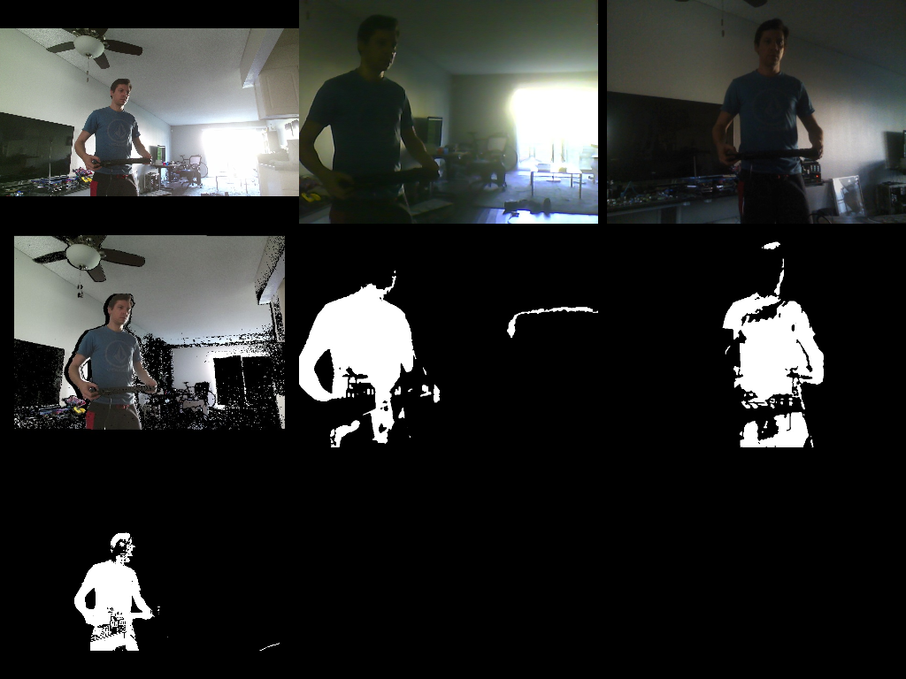

## OASIS

OASIS is a smart home operating system based on ROS 2.

OASIS currently specializes in computer vision, input streaming and general automation.

## Computer Vision

In my home I have a Kinect 2 and a bunch of poor quality laptop cameras.

I ported the [Kinect 2 driver](https://github.com/eigendude/oasis_kinect2/) to ROS 2. I also run a background subtractor on all camera feeds courtesy of [bgslibrary](https://github.com/andrewssobral/bgslibrary).

Kodi is my visual interface. I added [Smart Home support](https://github.com/xbmc/xbmc/pull/21183) so that it can show multiple ROS image topics.

## Input streaming

Kodi is also my input interface.
I connected a Bluetooth adapter to my NAS and it streams game controller input on a ROS topic.

Currently, I'm using my PS4 controller to control the speed of my childhood LEGO train.
A Raspberry Pi subscribes to the input, and controls an Arduino connected to a robotics motor controller that drives the train's 9V motors.

## Firmata Protocol implementation

To communicate with the Arduino, I added a complete Firmata implementation with additional support for temperature and humidity sensors, I2C, sonar, stepper motors, SPI, servos and CPU fans.
The Firmata code is at [oasis_avr/src/firmata](oasis_avr/src/firmata).

I built a custom LEGO Train Power Station to house the motor controller, Raspberry Pi, and Arduino:

Here's a video walkthrough of the Power Station:

## Dual display video artwork

I'm using an Intel NUC to drive dual 50" TVs for the purpose of showing video artwork.
The UI is again Kodi, running on the Wayland window manager, modified to span both displays.

Because it uses Kodi, virtually any video file can be played spanning both TVs:

## LEGO Train HUD

When the train is in motion, a basic HUD (heads up display) fades in on top of the video artwork and shows some voltages and metrics.

