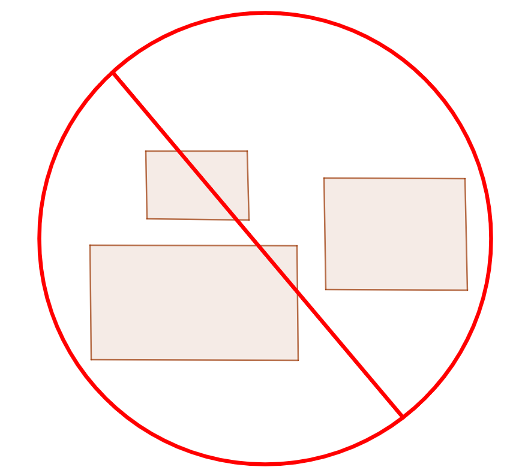

# Gnome Extensions for HUD functionality

## Hide Cursor (OASIS edition)

Hide the mouse cursor on inactivity.

For use on Wayland, since unclutter, unclutter-xfixes and xbanish only work on X11.

Note: This initial version has a hardcoded 5 second timeout.

Adapted from the original version by [elcste](https://extensions.gnome.org/accounts/profile/elcste) for my OASIS smarthome OS (https://github.com/eigendude/OASIS).

## Hide Panel Lite (Gnome 45+)

Hide top panel except in overview, for Gnome 45+.

Adapted for Gnome 45+ from the original extension by [fthx](https://extensions.gnome.org/accounts/profile/fthx) for my OASIS smarthome OS (https://github.com/eigendude/OASIS).

## No overview at start-up (Gnome 45+)

No overview at start-up for Gnome 45+. Nothing more.

Adapted for Gnome 45+ from the original extension by [fthx](https://extensions.gnome.org/accounts/profile/fthx) for my OASIS smarthome OS (https://github.com/eigendude/OASIS).
